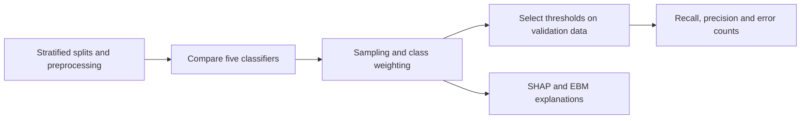
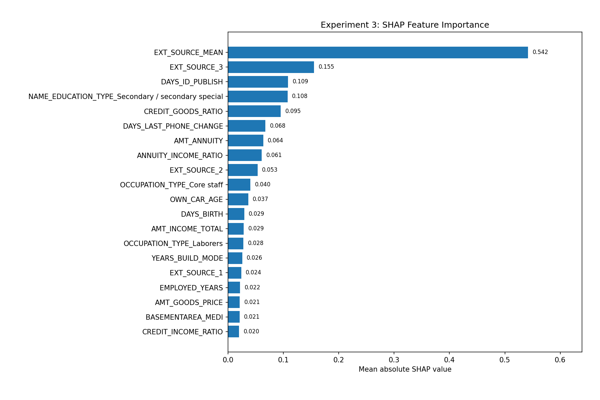
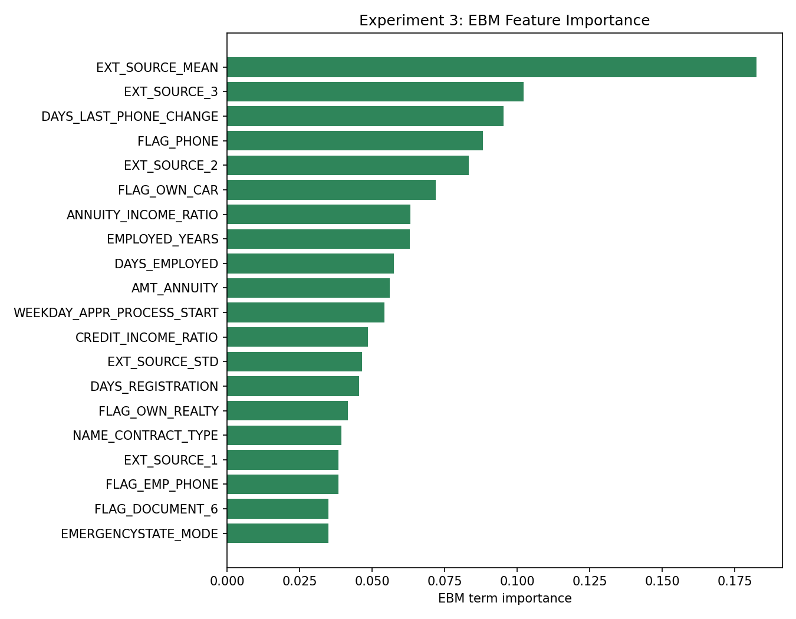

# Credit risk under class imbalance

An individual undergraduate research project comparing credit-risk classifiers, imbalance strategies, and decision thresholds. The question is practical: detecting more applicants with payment difficulty can also flag many more applicants who do not have it. SHAP and Explainable Boosting Machine (EBM) help examine the models' predictions.

`Python` · `scikit-learn` · `XGBoost` · `LightGBM` · `SHAP` · `EBM`

## A result worth examining

Changing the threshold of the original XGBoost method in Experiment 2 produced the following saved **validation-set** results:

| Operating point | Positive-class recall | Positive-class precision | False negatives | False positives |
| --- | ---: | ---: | ---: | ---: |
| Default threshold | 0.0183 | 0.6355 | 3,656 | 39 |
| Validation-selected best-F1 threshold | 0.4165 | 0.2430 | 2,173 | 4,831 |

The adjusted threshold detects more positive cases, but creates substantially more false alarms. That tradeoff is the result—not evidence of universally better lending decisions or financial savings. The [full comparison](results/experiment_2/experiment_2_full_all_v2_results.csv) includes other imbalance methods and operating points.

Threshold selection and reporting use the same validation split, which can make the selected result optimistic. The code reserves a test split, but the current Experiment 1 and 2 reporting paths do not evaluate it. A separate evaluation is needed after fixing the model and threshold.

## Research design

The Home Credit Default Risk dataset labels `TARGET = 1` as payment difficulty and `TARGET = 0` as its absence. It does not measure monetary loss.



| Experiment | Question | Implementation | Saved results |
| --- | --- | --- | --- |
| 1 — model comparison | How do logistic regression, random forest, XGBoost, LightGBM, and EBM compare? | [Model selection](src/experiment_1_model_selection.py) | [Tables](results/experiment_1) |
| 2 — imbalance and thresholds | How do resampling, weighting, and thresholds change missed detections and false alarms? | [Imbalance experiments](src/experiment_2_imbalance.py) | [Metrics](results/experiment_2) |
| 3 — interpretation | Which features contribute to model predictions? | [Interpretability](src/experiment_3_interpretability.py) | [Global importance](results/experiment_3) |

I carried out the project individually, from [numeric/categorical preprocessing](src/preprocessing.py) through model comparison, imbalance experiments, and interpretation. The scripts use stratified splits and a fixed random seed where applicable.

## Looking inside the models





These aggregated plots describe model behavior, not causal effects or fairness guarantees. Borrower-level records and local explanations are excluded.

## Run the experiments

Create a Python virtual environment and install the dependencies:

```bash
python -m venv .venv
# Linux or macOS
source .venv/bin/activate
# Windows PowerShell: .\.venv\Scripts\Activate.ps1
python -m pip install -r requirements.txt
```

Obtain `application_train.csv` from [Kaggle](https://www.kaggle.com/c/home-credit-default-risk/data), follow its access terms, and place it in `data/raw/`. From the repository root:

```bash
python src/data_check.py
python src/experiment_1_model_selection.py
python src/experiment_2_imbalance.py --quick-test
python src/experiment_3_interpretability.py --quick-test
```

Quick mode uses a smaller sample and does not reproduce the archived full-run metrics. For the full Experiment 2 configuration and interpretation run:

```bash
python src/experiment_2_imbalance.py --include-slow-methods --include-ebm --run-name full_all_v2
python src/experiment_3_interpretability.py
```

New artifacts go to `outputs/`; archived tables remain in `results/`. Dependencies are not version-pinned, so exact numerical reproduction may require the original library versions and runtime environment. The full dataset experiments were not rerun when preparing this repository.

## Interpretation limits and research support

- The 5:1 and 10:1 FN-to-FP cost ratios are assumed sensitivity scenarios, not measured lender costs.
- Experiments 1 and 2 use separate fits; their results are not the same baseline run.
- An NSTC undergraduate research grant was approved for 2026–2027. The research is ongoing; approval is not a completed research award or peer-reviewed publication.

The source comes from my [existing research repository](https://github.com/shenlian1023/Imbalanced_data_predict/tree/f131ecc372aaa393060a6bd7778d293dfccb305b). Aggregated tables and figures come from the project exhibition materials. Raw applicant data, trained models, personal documents, and credentials are not included.
