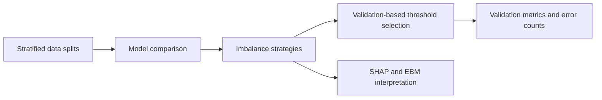

# Interpretable credit risk

An individual undergraduate research project on credit-risk classification with imbalanced labels. I compare models, test imbalance-handling strategies, and examine how decision thresholds change missed detections and false alarms. SHAP and Explainable Boosting Machine (EBM) provide feature-level interpretation.

`Python` · `scikit-learn` · `XGBoost` · `LightGBM` · `SHAP` · `EBM`

## Research question

A classifier can achieve high accuracy while detecting few applicants with payment difficulty. How do model choice, resampling, class weighting, and threshold selection change that tradeoff? Which features contribute to the predictions?

The experiments use the Home Credit Default Risk dataset. `TARGET = 1` denotes payment difficulty; `TARGET = 0` denotes its absence. This label is not a measured monetary loss.

## Experiment design



| Stage | Question | Code | Saved evidence |
| --- | --- | --- | --- |
| 1 | How do baseline classifiers compare? | [Model selection](src/experiment_1_model_selection.py) | [Comparison tables](results/experiment_1) |
| 2 | What changes after sampling, weighting, or threshold adjustment? | [Imbalance experiments](src/experiment_2_imbalance.py) | [Metrics and thresholds](results/experiment_2) |
| 3 | Which features influence model predictions? | [Interpretability](src/experiment_3_interpretability.py) | [Global importance](results/experiment_3) |

The baseline comparison includes logistic regression, random forest, XGBoost, LightGBM, and EBM. Numeric and categorical preprocessing lives in [preprocessing.py](src/preprocessing.py); the scripts use stratified splits and a fixed random seed where applicable.

## A threshold tradeoff

For the original XGBoost method in Experiment 2, changing the threshold produces these saved results. The current experiment script computes this comparison on the validation split:

| Operating point | Recall, TARGET = 1 | Precision, TARGET = 1 | False negatives | False positives |
| --- | ---: | ---: | ---: | ---: |
| Default threshold | 0.0183 | 0.6355 | 3,656 | 39 |
| Validation-selected best-F1 threshold | 0.4165 | 0.2430 | 2,173 | 4,831 |

The lower threshold detects more positive cases and creates substantially more false alarms. It changes the operating point; it does not establish a universally better lending decision. See the [full Experiment 2 results](results/experiment_2/experiment_2_full_all_v2_results.csv) for other methods and thresholds.

Threshold selection and the reported comparison use the same validation split, so the selected operating point can look optimistic. The preprocessing code reserves a test split, but the current Experiment 1 and 2 reporting paths do not evaluate it. Generalization claims require a separate evaluation after fixing the model and threshold.

The cost comparisons use assumed FN-to-FP cost ratios of 5:1 and 10:1. They are sensitivity scenarios, not actual lender costs or evidence of financial savings. Results from Experiment 1 and Experiment 2 belong to separate fits and should not be treated as the same baseline run.

## Global interpretation


These plots describe model behavior. Feature importance does not establish causality, fairness, or a reason to approve or deny an individual application. Borrower-level records and local explanations are excluded from this snapshot.

## Run the experiments

Use a Python virtual environment and install the dependencies:

```bash
python -m venv .venv
# Linux or macOS
source .venv/bin/activate
# Windows PowerShell: .\.venv\Scripts\Activate.ps1
python -m pip install -r requirements.txt
```

Obtain the dataset from [Kaggle](https://www.kaggle.com/c/home-credit-default-risk/data), follow its access terms, and place `application_train.csv` in `data/raw/`. Run commands from the project root:

```bash
python src/data_check.py
python src/experiment_1_model_selection.py
python src/experiment_2_imbalance.py --quick-test
python src/experiment_3_interpretability.py --quick-test
```

Quick mode checks a smaller sample; it does not reproduce the archived full-run metrics. The full Experiment 2 configuration can be run with:

```bash
python src/experiment_2_imbalance.py --include-slow-methods --include-ebm --run-name full_all_v2
python src/experiment_3_interpretability.py
```

The scripts write new artifacts to `outputs/`. Archived tables stay in `results/`, so a rerun does not overwrite the presentation evidence. Dependencies are not version-pinned, and exact numerical reproduction may require the original library versions and runtime environment.

## Research support and source

The project received approval for an NSTC undergraduate research grant running from 2026 to 2027. Approval supports the ongoing research; it is not a completed research award or a peer-reviewed publication.

The Python source comes from my [existing research repository](https://github.com/shenlian1023/Imbalanced_data_predict/tree/f131ecc372aaa393060a6bd7778d293dfccb305b). Aggregated tables and figures come from the project exhibition materials. The existing repository remains unchanged.

Raw data, processed applicant records, trained models, personal documents, and credentials are excluded. The experiment scripts have not been rerun on the full dataset during this packaging task.
