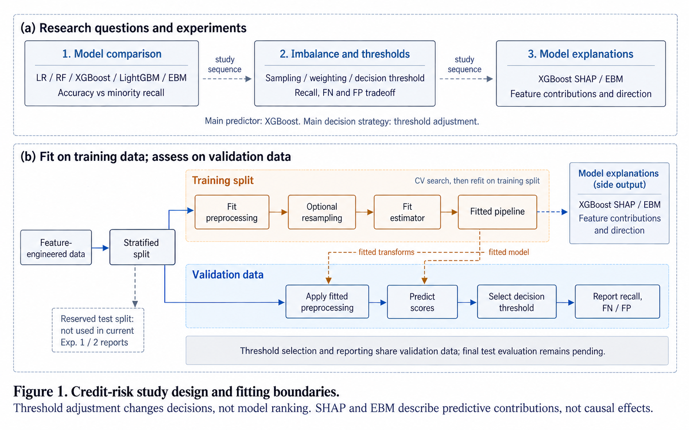

# Credit-risk study design and fitting boundaries

[Project overview](../README.md) · [Implementation notes](implementation.md) · [Exhibition sources](exhibition-notes.md) · [Generation prompt](prompts/method-overview.txt) · [Refinement prompt](prompts/method-overview-refinement.txt)

The upper panel separates model comparison, imbalance/decision strategies, and interpretation. These correspond to [Experiment 1](../src/experiment_1_model_selection.py), [Experiment 2](../src/experiment_2_imbalance.py), and [Experiment 3](../src/experiment_3_interpretability.py). The exhibition's selected main predictor is XGBoost with threshold adjustment. EBM is separately fitted for interpretation; it is not a component receiving XGBoost's fitted parameters.

The lower panel abstracts Experiment 2. Cross-validation fits preprocessing and any selected sampler inside each training fold, scores the held-out fold, then refits the selected pipeline on the outer training split. Validation data receives fitted preprocessing and model prediction, not training-set resampling. The separate fitting and prediction paths describe responsibilities, not every library call or all experiment scripts as one unified pipeline.

Validation scores support threshold selection and FN/FP comparison. Selecting and reporting on that same split can be optimistic. Although code reserves test data, the current Experiment 1 and 2 reporting paths do not evaluate it. The illustration does not establish independent-test performance, financial savings, calibration, fairness, or causal effects.

## Figure provenance

Created and refined with the built-in image-generation tool using the paper-comic paper-figure style. Reviewed against source, saved aggregate results, and the supplied exhibition poster/presentation. The refinement distinguishes fold-local CV fitting from final training-split refitting and routes fitted preprocessing from the fitted pipeline. This AI-generated method illustration contains no new experimental evidence. Saved prompts document its layout and constraints.
